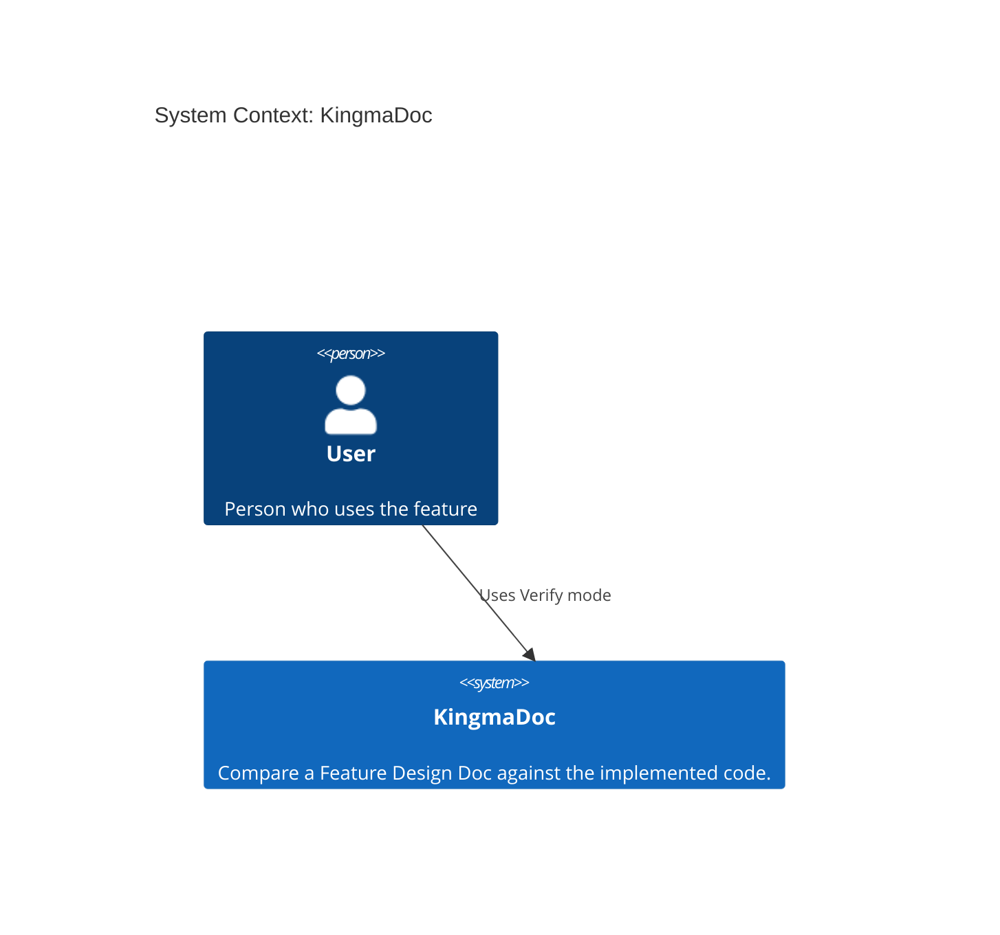
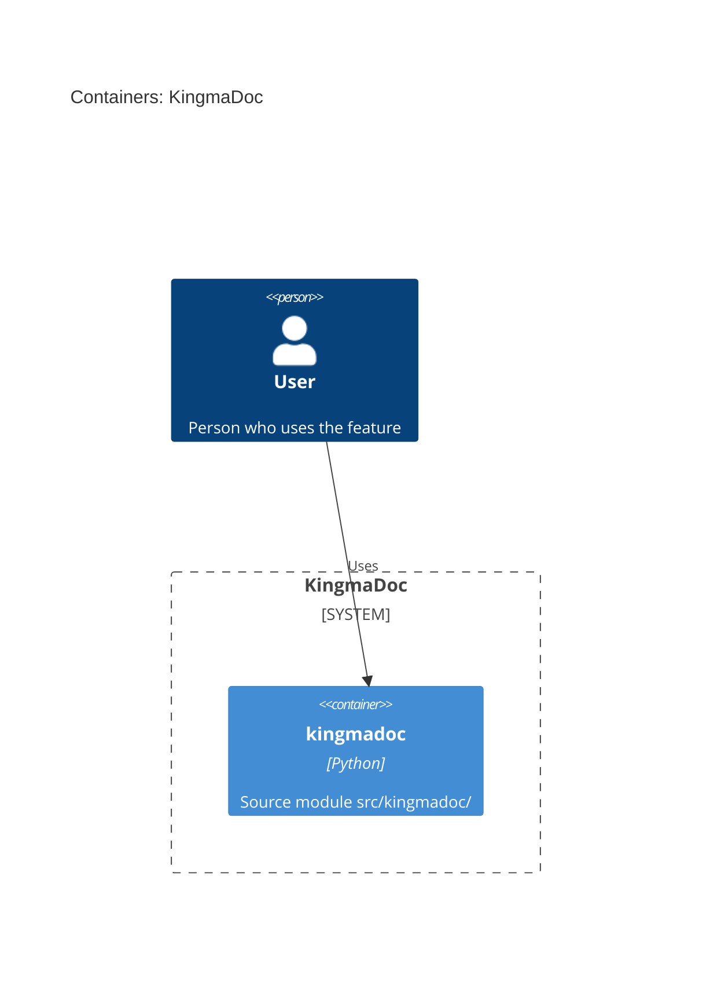

# Feature Design Doc: Verify mode

| | |
|---|---|
| **Project** | KingmaDoc |
| **Status** | Draft |
| **Generated** | 2026-09-26 by KingmaDoc 0.1.0 |

> Generated before implementation. Review every section: diagrams and module
> lists are inferred from the codebase and are a starting point, not the truth.

## 1. Summary

Compare a Feature Design Doc against the implemented code.

## 2. Clarifying questions

**Q1. What problem does this feature solve, and for whom?**
Developers lose track of what an AI agent built; they need a verification doc.

**Q2. Who or what triggers it (end user, scheduled job, external system, ...)?**
The developer, via the kingmadoc verify command.

**Q3. Which external systems, services, or data stores does it interact with?**
None; reads local files and runs the project test command.

**Q4. Which existing modules will change? (detected modules: `src/kingmadoc`)**
src/kingmadoc/cli.py and a new src/kingmadoc/verify package.

**Q5. How will you know it works? List the acceptance criteria.**
verify produces a doc listing deviations from design.md and test/lint results.

## 3. Codebase context

**Tech stack:** Click, Jinja2, Python

| Language | Files |
|---|---|
| Python | 10 |

<details>
<summary>File tree (18 files)</summary>

```text
KingmaDoc/
├── examples/
│   └── verify-mode-design.md
├── src/
│   └── kingmadoc/
│       ├── diagrams/
│       │   └── …
│       ├── plan/
│       │   └── …
│       ├── __init__.py
│       ├── cli.py
│       ├── config.py
│       └── exceptions.py
├── templates/
│   └── plan_default.md.j2
├── tests/
│   └── test_config.py
├── .featuredoc.yml
├── .gitignore
├── CLAUDE.md
├── LICENSE
├── pyproject.toml
└── README.md
```

</details>

## 4. C4 Context

Who uses the system and which external systems it depends on.



## 5. C4 Container

The runnable units inside the system (inferred from source directories).



## 6. C4 Component

_TODO: components inside the container this feature changes._

## 7. Sequence

_TODO: the main flow of the feature, step by step._

## 8. Class model

_TODO: new or changed classes and their relationships._

## 9. Implementation plan

- [ ] _TODO: step 1_
- [ ] _TODO: step 2_

## 10. Validation plan

How the developer can check the result without reading every line of code.

- [ ] Build succeeds
- [ ] Tests pass (list new tests here)
- [ ] Lint is clean
- [ ] Manual check: _TODO_

## 11. Risks and open questions

- _TODO_
