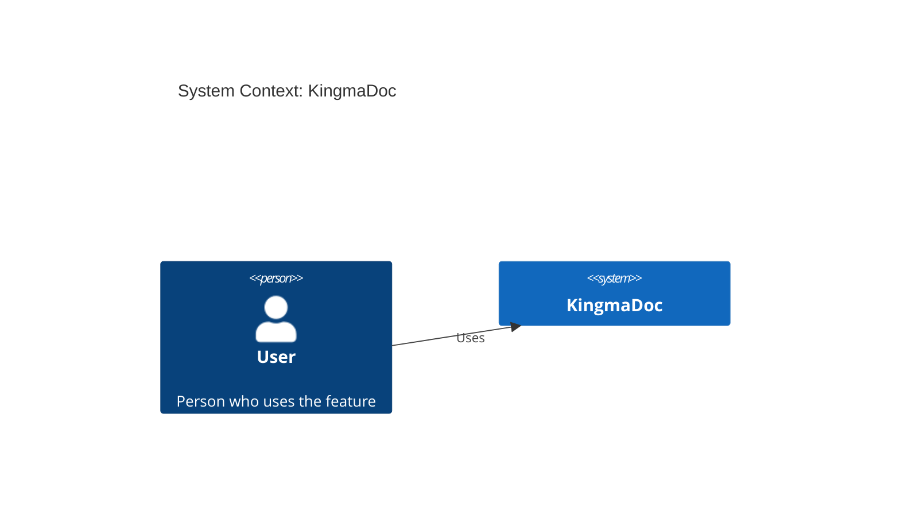
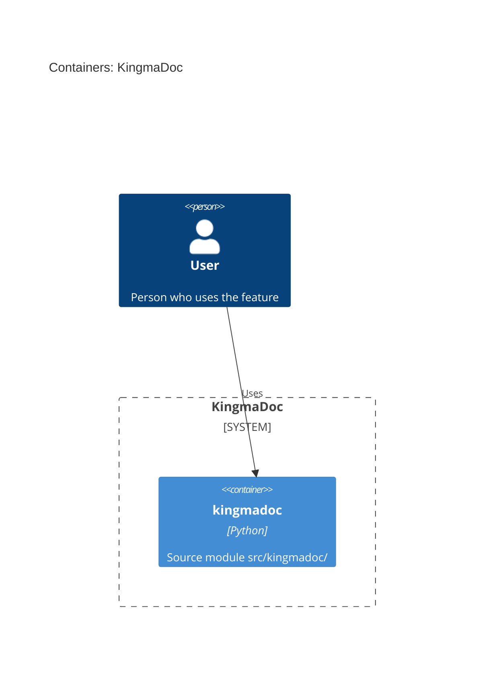

# Feature: Add a verify mode that compares a plan doc against the implemented code.

| | |
|---|---|
| **Project** | KingmaDoc |
| **Status** | Draft |
| **Generated** | 2026-09-28T10:44+00:00 by KingmaDoc 0.1.0.dev50 |

> Generated before implementation. Fill in every _TODO_ and review everything marked
> _(inferred)_: it comes from the codebase analysis and is a starting point, not the truth.

## One-sentence summary

Add a verify mode that compares a plan doc against the implemented code.

## Scope (in / out)

**In scope**

- _TODO: what this feature delivers._

**Out of scope**

- _TODO: what it deliberately does not do._

## Planned changes

- `src/kingmadoc/cli.py`: _TODO: what changes here and why._
- `src/kingmadoc/verify`: _TODO: what changes here and why._

## Requirements

_Rewrite each in EARS: WHEN <trigger> THE SYSTEM SHALL <response>._

- **REQ-1**: verify produces a doc listing deviations from the plan doc and test/lint results
  Verified by: _TODO_

## Assumptions

- _(inferred)_ Built on the existing stack: Click, Jinja2, Python.
- _TODO: what must be true for this plan to work (users, data, services, limits)._

## Risks

- _TODO: what could go wrong, and how you will notice or limit it._

## C4 Context (Mermaid)

Who uses the system and which external systems it depends on.



## C4 Container (Mermaid)

The runnable units inside the system _(inferred from source directories)_.



## Class diagram (Mermaid)

The classes this feature touches and their direct collaborators.

_Disabled in `.featuredoc.yml` (`diagrams`)._

## Sequence diagram (Mermaid)

### Current (inferred)

_Disabled in `.featuredoc.yml` (`diagrams`)._

### New

_Disabled in `.featuredoc.yml` (`diagrams`)._

## Open questions

- [ ] _TODO: anything else that must be decided before implementation._

**Answered while planning**

- **What problem does this feature solve, and for whom?** Developers lose track of what an AI agent built; they need a verification doc.
- **Who or what triggers it (end user, scheduled job, external system, ...)?** The developer, via the kingmadoc verify command.
- **Which external systems, services, or data stores does it interact with?** None; reads local files and runs the project test command.
- **Which existing modules will change? (detected modules: `src/kingmadoc`)** src/kingmadoc/cli.py and a new src/kingmadoc/verify package.
- **How will you know it works? List the acceptance criteria.** verify produces a doc listing deviations from the plan doc and test/lint results.

## Appendix: codebase context _(inferred)_

- **Tech stack:** Click, Jinja2, Python
- **Entry points:** _none found_
- **Config files:** `pyproject.toml`
- **Test directories:** `tests`

| Language | Files |
|---|---|
| python | 113 |
| markdown | 28 |
| jinja | 6 |
| yaml | 3 |
| json | 2 |
| toml | 1 |

<details>
<summary>File tree (230 files)</summary>

```text
KingmaDoc/
├── .claude/
│   ├── skills/
│   │   └── checking-conventions/
│   │       └── …
│   └── settings.json
├── .github/
│   ├── ISSUE_TEMPLATE/
│   │   ├── bug_report.md
│   │   └── feature_request.md
│   └── workflows/
│       ├── ci.yml
│       └── release.yml
├── .hypothesis/
│   ├── constants/
│   │   ├── 021ecad571f501c4
│   │   ├── 0379b6ca57f0783f
│   │   ├── 0b0dfdcede5596e1
│   │   ├── 1b81a71a7607fbf6
│   │   ├── 2003bed8cb6acdf2
│   │   ├── 2e00d1a2bca2c453
│   │   ├── 390efa9697d4e1bf
│   │   ├── 429e7d227d43fa43
│   │   ├── 488a16471d4a5a9a
│   │   ├── 4c88cacf6c8e4c7d
│   │   ├── 4f38a2b8fdbc0e4b
│   │   ├── 51c35758aac2bab5
│   │   ├── 55915e632dbf0f71
│   │   ├── 57e843cfe884a224
│   │   ├── 583a89d35ba933dd
│   │   ├── 5d45513b79aabad7
│   │   ├── 5f0dcf0398739489
│   │   ├── 5f8c64643045c357
│   │   ├── 60831149ff3a2967
│   │   ├── 686c8cce11251820
│   │   ├── 69eaf0facf3541e7
│   │   ├── 6b0fa85cb45db293
│   │   ├── 7294e3a783cbf3a8
│   │   ├── 7690150393b314b0
│   │   ├── 7716c173bdc714c6
│   │   ├── 7c1e245a4af2a784
│   │   ├── 80f3eb9fe296aa5f
│   │   ├── 8310d3b7a356f92f
│   │   ├── 86419387d03b2884
│   │   ├── 8aa219ffee19f95c
│   │   ├── 8b1b03f5681dbbd2
│   │   ├── 8ee2b55b51643314
│   │   ├── 969910a0ba7bf0a2
│   │   ├── a50b8adba853bc36
│   │   ├── aaad66f0208d6fda
│   │   ├── adb700443bac7ce4
│   │   ├── b14d3b80cc53ed3d
│   │   ├── bb0b868e4b9a8187
│   │   ├── c0b457a05760d55b
│   │   ├── c12237819ce468fd
│   │   ├── c2581a6a64184d40
│   │   ├── c743dc86980c4608
│   │   ├── c7c62939844fec2e
│   │   ├── cc4dfad2dc9d75e2
│   │   ├── cd82d38bc12deabd
│   │   ├── d6e5d66b09a82b49
│   │   ├── da39a3ee5e6b4b0d
│   │   ├── e36626a891f1bf04
│   │   ├── eb95a699ef557106
│   │   ├── f4481751579327cb
│   │   ├── fb02557056414592
│   │   └── fdfd47c59de6a608
│   ├── unicode_data/
│   │   └── 14.0.0/
│   │       └── …
│   └── .gitignore
├── docs/
│   ├── conventions.md
│   ├── index.md
│   ├── releasing.md
│   ├── roadmap.md
│   └── test-plan.md
├── examples/
│   └── verify-mode-plan.md
├── scripts/
│   ├── build_skill_variants.py
│   ├── build_threat_reference.py
│   ├── import_tmt_knowledge_base.py
│   └── run_evals.py
├── skill/
│   ├── explaining-code/
│   │   ├── reference/
│   │   │   └── …
│   │   └── SKILL.md
│   ├── reference/
│   │   ├── diagram-rules.md
│   │   └── formats.md
│   ├── codex.md
│   ├── copilot.md
│   ├── cursor.md
│   └── SKILL.md
├── src/
│   └── kingmadoc/
│       ├── diagrams/
│       │   └── …
│       ├── facts/
│       │   └── …
│       ├── plan/
│       │   └── …
│       ├── templates/
│       │   └── …
│       ├── threats/
│       │   └── …
│       ├── verify/
│       │   └── …
│       ├── __init__.py
│       ├── about.py
│       ├── adr.py
│       ├── cli.py
│       ├── config.py
│       ├── d2_binary.py
│       ├── documents.py
│       ├── exceptions.py
│       ├── explain.py
│       ├── git.py
│       ├── naming.py
│       ├── plandoc.py
│       ├── raster.py
│       ├── render.py
│       ├── scaffold.py
│       ├── screenshots.py
│       ├── skills.py
│       ├── templating.py
│       └── vscode.py
├── tests/
│   ├── data/
│   │   └── d2-sample.svg
│   ├── fixtures/
│   │   ├── backends/
│   │   │   └── …
│   │   └── mermaid/
│   │       └── …
│   ├── conftest.py
│   ├── test_adr.py
│   ├── test_adr_numbering.py
│   ├── test_analyzer.py
│   ├── test_cli.py
│   ├── test_cli_encoding.py
│   ├── test_cli_init.py
│   ├── test_cli_plan_custom_template.py
│   ├── test_cli_sigint.py
│   ├── test_cli_verify_config.py
│   ├── test_config.py
│   ├── test_config_poetry.py
│   ├── test_config_shape.py
│   ├── test_d2_download.py
│   ├── test_dependencies.py
│   ├── test_dependency_graph_model.py
│   ├── test_design_diagrams_compile.py
│   ├── test_design_models.py
│   ├── test_diagram_backends.py
│   ├── test_diagrams_mermaid.py
│   ├── test_documents.py
│   ├── test_duplicate_names.py
│   ├── test_evals.py
│   ├── test_explain.py
│   ├── test_explain_check.py
│   ├── test_explain_config.py
│   ├── test_explain_status.py
│   ├── test_extra_designs_coverage.py
│   ├── test_facts.py
│   ├── test_facts_code.py
│   ├── test_facts_data_model.py
│   ├── test_facts_dominators.py
│   ├── test_functional_design.py
│   ├── test_generator.py
│   ├── test_grep_performance.py
│   ├── test_manifests.py
│   ├── test_max_lines_per_file.py
│   ├── test_output_dir.py
│   ├── test_plan_e2e.py
│   ├── test_plandoc.py
│   ├── test_properties.py
│   ├── test_raster.py
│   ├── test_render.py
│   ├── test_scaffold.py
│   ├── test_screenshots.py
│   ├── test_security_domain_designs.py
│   ├── test_skill.py
│   ├── test_skill_explaining_code.py
│   ├── test_skill_models.py
│   ├── test_skills_install.py
│   ├── test_source_dirs.py
│   ├── test_summary_slug_diagram_defaults.py
│   ├── test_technical_design.py
│   ├── test_templating_security.py
│   ├── test_threats.py
│   ├── test_verify.py
│   ├── test_verify_locate.py
│   ├── test_version.py
│   └── test_vscode_preview.py
├── .featuredoc.yml
├── .gitignore
├── CHANGELOG.md
├── CLAUDE.md
├── CONTRIBUTING.md
├── LICENSE
├── pyproject.toml
├── README.md
└── uv.lock
```

</details>
