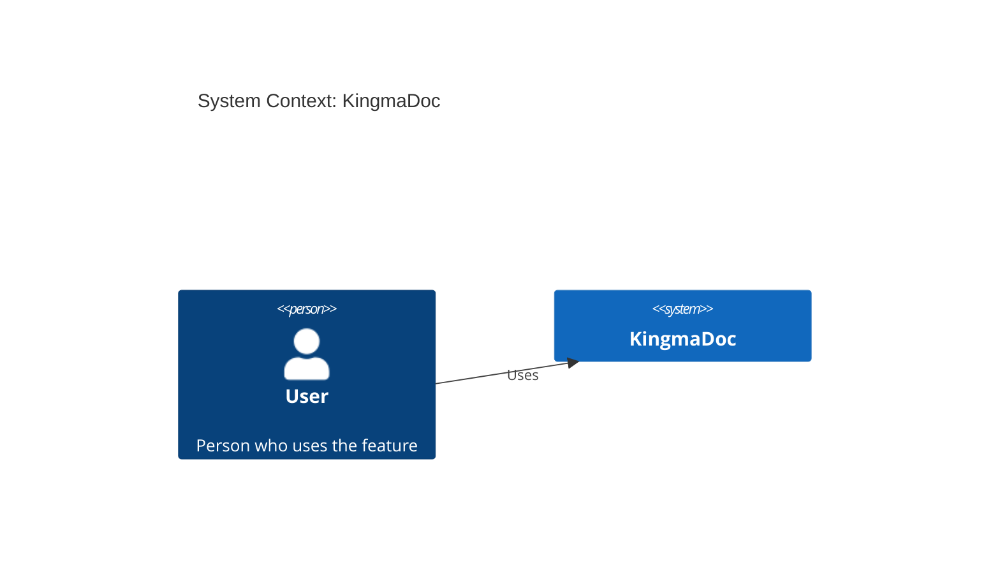
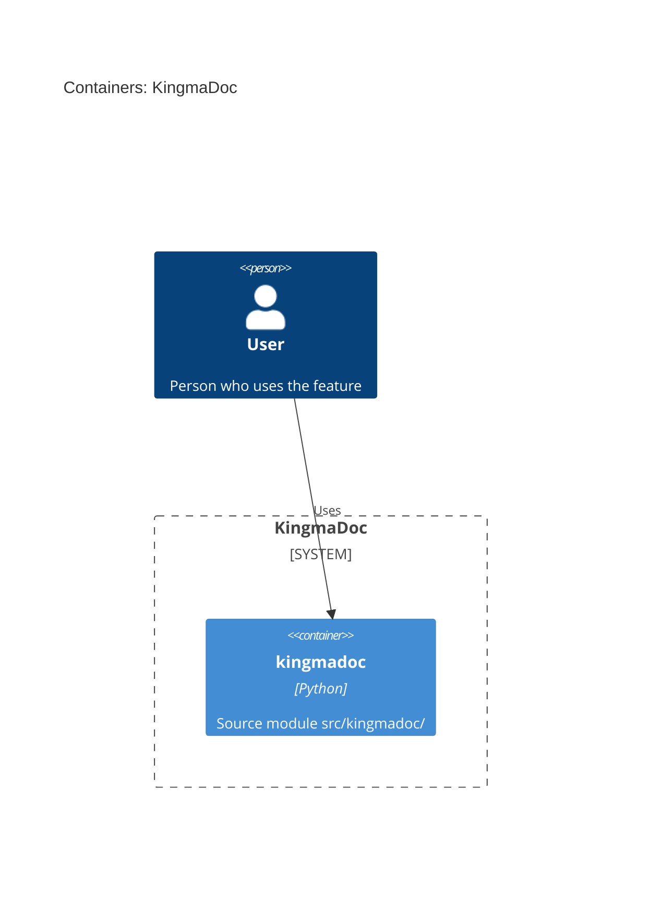

# Feature: Add a verify mode that compares a plan doc against the implemented code.

| | |
|---|---|
| **Project** | KingmaDoc |
| **Status** | Draft |
| **Generated** | 2026-09-26T18:06+02:00 by KingmaDoc 0.1.0 |

> Generated before implementation. Fill in every _TODO_ and review everything marked
> _(inferred)_: it comes from the codebase analysis and is a starting point, not the truth.

## One-sentence summary

Add a verify mode that compares a plan doc against the implemented code.

**Full description:** Add a verify mode that compares a plan doc against the implemented code. It reports deviations and test/lint results.

## Scope (in / out)

**In scope**

- _TODO: what this feature delivers._

**Out of scope**

- _TODO: what it deliberately does not do._

## Assumptions

- _(inferred)_ Built on the existing stack: Click, Jinja2, Python.
- _TODO: what must be true for this plan to work (users, data, services, limits)._

## Risks

- _TODO: what could go wrong, and how you will notice or limit it._

## C4 Context (Mermaid)

Who uses the system and which external systems it depends on.



## C4 Container (Mermaid)

The runnable units inside the system _(inferred from source directories)_.



## Open questions

- [ ] _TODO: anything else that must be decided before implementation._

**Answered while planning**

- **What problem does this feature solve, and for whom?** Developers lose track of what an AI agent built; they need a verification doc.
- **Who or what triggers it (end user, scheduled job, external system, ...)?** The developer, via the kingmadoc verify command.
- **Which external systems, services, or data stores does it interact with?** None; reads local files and runs the project test command.
- **Which existing modules will change? (detected modules: `src/kingmadoc`)** src/kingmadoc/cli.py and a new src/kingmadoc/verify package.
- **How will you know it works? List the acceptance criteria.** verify produces a doc listing deviations from the plan doc and test/lint results.

## Appendix: codebase context _(inferred)_

- **Tech stack:** Click, Jinja2, Python
- **Entry points:** _none found_
- **Config files:** `pyproject.toml`
- **Test directories:** `tests`

| Language | Files |
|---|---|
| python | 16 |
| markdown | 7 |
| json | 1 |
| yaml | 1 |
| toml | 1 |
| jinja | 1 |

<details>
<summary>File tree (32 files)</summary>

```text
KingmaDoc/
├── .claude/
│   ├── skills/
│   │   └── checking-conventions/
│   │       └── …
│   └── settings.json
├── docs/
│   ├── features/
│   │   └── add-user-authentication/
│   │       └── …
│   ├── conventions.md
│   └── index.md
├── examples/
│   └── verify-mode-plan.md
├── src/
│   └── kingmadoc/
│       ├── diagrams/
│       │   └── …
│       ├── plan/
│       │   └── …
│       ├── __init__.py
│       ├── cli.py
│       ├── config.py
│       └── exceptions.py
├── templates/
│   └── plan_default.md.j2
├── tests/
│   ├── fixtures/
│   │   └── c4/
│   │       └── …
│   ├── test_analyzer.py
│   ├── test_cli.py
│   ├── test_config.py
│   ├── test_diagrams_c4.py
│   ├── test_generator.py
│   └── test_plan_e2e.py
├── .featuredoc.yml
├── .gitignore
├── CLAUDE.md
├── LICENSE
├── pyproject.toml
└── README.md
```

</details>
