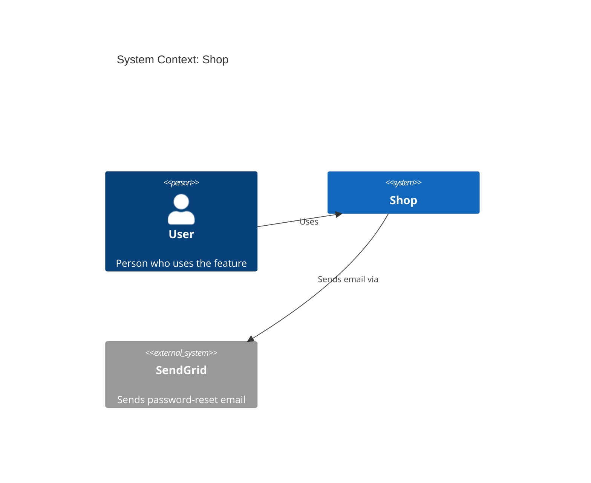
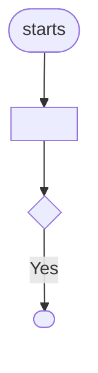

<!-- KingmaDoc 1.0.0 for Codex. Generated from skill/SKILL.md by scripts/build_skill_variants.py; do not edit by hand.
     Install as: AGENTS.md (repository root) -->

# KingmaDoc

> These instructions are loaded in every session. Follow them only when the user
> asks to plan, design or scope a feature, or to verify what was built against its
> plan (see [When to use this skill](#when-to-use-this-skill)); otherwise ignore them.

KingmaDoc prevents _code blindness_: the developer (and every later agent session) can
see what a feature is meant to do before it is built, and what was actually built
afterwards, without reading every line of code. You produce two Markdown files per
feature in `docs/features/`: `<slug>-plan.md` and `<slug>-verify.md`.

Contents: [When to use](#when-to-use-this-skill) · [Mode 1: plan](#mode-1-plan) ·
[Mode 2: verify](#mode-2-verify) · [Diagram rules](#diagram-rules) ·
[Output format](#output-format)

## When to use this skill

| Mode       | Use when the user…                                                                     | Output                           |
| ---------- | -------------------------------------------------------------------------------------- | -------------------------------- |
| **plan**   | wants to build, add, design or scope a feature and no code has been written for it yet | `docs/features/<slug>-plan.md`   |
| **verify** | has implemented (part of) a planned feature and wants to know if it matches the plan   | `docs/features/<slug>-verify.md` |

- If the user asks to implement a feature and no plan exists, run **plan** first and
  get approval before changing code.
- If the user says "check", "verify", "review against the plan" or names an existing
  `*-plan.md`, run **verify**.
- If it is unclear which mode is meant, ask one short question.

Ground rules for both modes:

- **Never invent facts.** Everything you derive from the code is marked _(inferred)_;
  everything only the human can know is a `_TODO: …_` placeholder or an open question.
- **Do not change source code** in either mode. You only write the two doc files.
- **Never delete** existing feature docs. If the target file exists, ask before
  overwriting it.
- If the `kingmadoc` command is on `PATH` (`command -v kingmadoc`), prefer it for the
  deterministic parts (see the steps). The docs must look the same either way.

## Mode 1: plan

### Step 1. Read the configuration

Read `.featuredoc.yml` in the project root if it exists. Use these keys (defaults in
brackets); ignore the file if it is absent:

- `output_dir` [`docs/features`]: where docs are written.
- `max_questions` [`5`]: number of clarifying questions (never more than 5).
- `project.name` [project directory name] and `project.description` [empty].
- `analyzer.exclude_dirs` [`.git`, `node_modules`, `.venv`, `venv`, `__pycache__`,
  `dist`, `build`, `*.egg-info`, tool caches], `analyzer.max_files` [`5000`],
  `analyzer.tree_depth` [`3`].
- `diagrams` [`c4_context`, `c4_container`]: which C4 sections get a diagram.
- `extra_designs.functional_design.enabled` / `extra_designs.technical_design.enabled`
  [`false`]: also write a functional and/or technical design doc.

### Step 2. Analyze the codebase

If `kingmadoc` is installed, run `kingmadoc analyze --json` and use its output for this
step. Otherwise use file search and text search (never read the whole codebase):

1. **Files.** List files matching `**/*`, skipping the excluded directories. Stop at `max_files`
   and note in the appendix that the analysis is truncated.
2. **Languages.** Count files per extension: `.py` python, `.js/.jsx/.mjs` javascript,
   `.ts/.tsx` typescript, `.go` go, `.rs` rust, `.java` java, `.kt` kotlin, `.rb` ruby,
   `.php` php, `.cs` csharp, `.md` markdown, `.json` json, `.toml` toml,
   `.yml/.yaml` yaml, and so on. Sort by count, highest first.
3. **Top-level directories** that contain files.
4. **Entry points**: files named `main.py`, `app.py`, `__main__.py`, `manage.py`,
   `wsgi.py`, `asgi.py`, `server.py`, `index.{js,ts,tsx}`, `main.{js,ts,tsx,go,rs}`,
   `app.{js,ts}`, `server.{js,ts}`, `Program.cs`, `Main.java`, outside test directories.
5. **Config files** at most two directories deep: `pyproject.toml`, `setup.py`,
   `requirements.txt`, `package.json`, `tsconfig.json`, `go.mod`, `Cargo.toml`,
   `pom.xml`, `build.gradle*`, `Gemfile`, `composer.json`, `*.csproj`, `Dockerfile`,
   `docker-compose.y*ml`, `compose.y*ml`.
6. **Test directories**: outermost directories named `tests`, `test`, `__tests__`,
   `spec` or `specs`.
7. **Stack.** Read the config files and list languages, frameworks and services from
   their dependencies, e.g. `fastapi` → FastAPI, `django` → Django, `react` → React,
   `express` → Express, `psycopg2`/`asyncpg`/`pg`/`github.com/jackc/pgx` or a
   `postgres` image → PostgreSQL, `redis` → Redis, `mongo*` → MongoDB. Confirm
   frameworks with a text search on imports (e.g. `^\s*(from|import)\s+fastapi`). Only list
   what you actually found.
8. **Containers** for the C4 Container diagram: directories with source code
   (`src/<pkg>` counts as `<pkg>`; skip `tests`, `docs`, `examples`, `scripts`, hidden
   directories), at most 6. Technology = the most common language inside. If there are
   none, use one container named after the project, described as "Main application".

### Step 3. Ask clarifying questions

Ask the user these questions (at most `max_questions`, in this order), all in one
message, and say they may skip any:

1. What problem does this feature solve, and for whom?
2. Who or what triggers it (end user, scheduled job, external system, ...)?
3. Which external systems, services, or data stores does it interact with?
4. Which existing modules will change? (mention the detected containers)
5. How will you know it works? List the acceptance criteria.

If you cannot ask (non-interactive run), or the user skips a question, list it under
**Open questions** instead. Use the answers to fill in scope, assumptions, risks and
the diagrams, but never beyond what the user said or the code shows.

### Step 4. Generate the Feature Design Doc

- **Summary**: the first sentence (ends at `.`/`!`/`?` + capital letter, never at e.g./i.e./etc./vs./cf./approx.),
  whitespace collapsed, at most 120 characters (cut at a word boundary and end with `…`).
- **Slug**: the summary transliterated to ASCII (é→e), lowercase kebab-case, at most 40 characters at a word
  boundary; if non-Latin text leaves nothing, `feature-` + first 8 hex of its SHA-256.
  Example: "Add password reset via email. Links expire…" → `add-password-reset-via-email`.
- Fill every section of the [plan format](#plan-doc-docsfeaturesslug-planmd) in order.
  Scope, assumptions and risks come from the user's answers; anything not covered stays
  a `_TODO: …_` line. Add answered questions under "Answered while planning".
- External systems named in answer 3 go into the C4 Context diagram as `System_Ext`.
- Follow the [diagram rules](#diagram-rules).

### Step 5. Write the file and ask for approval

1. Write `<output_dir>/<slug>-plan.md` (ask first if it exists). For each enabled
   extra design, also write `<slug>-functional-design.md`
   ([format](#functional-design-doc-docsfeaturesslug-functional-designmd)) and/or
   `<slug>-technical-design.md`
   ([format](#technical-design-doc-docsfeaturesslug-technical-designmd)), in that
   order. Fill in only what the answers and code support; leave the rest as TODOs.
2. Show the paths and a three-line summary (scope, biggest risk, open questions count).
3. Ask the user to reply **yes** (approve), **edit <changes>**, or **stop**. On
   **edit**, update the doc and ask again. On **yes**, set **Status** to `Approved`.
   Do not change any source code before the plan is approved.

## Mode 2: verify

### Step 1. Find the plan

- If the user gave a slug, use `<output_dir>/<slug>-plan.md`. If they gave a path or a
  feature name, derive the slug from it.
- If no slug was given, list `<output_dir>/*-plan.md`. One match: use it. Several:
  ask which one. None: stop and tell the user to run plan mode first.
- If the plan file does not exist, say so, list the slugs that do exist, and stop.
  Do not write a verify doc without a plan.

### Step 2. Read the actual code

1. Read the whole plan doc: scope, assumptions, risks, both diagrams, open questions.
2. Find what changed for this feature: `git log --since="<Generated date>" --stat`
   and `git diff` (including uncommitted changes). Without git, use the modules named
   in the plan and the containers in the C4 Container diagram.
3. Read the changed files and the modules the plan says will change. Read only what is
   needed to judge each plan item; do not summarize unrelated code.

### Step 3. Compare and list deviations

Check each item and record every mismatch as a deviation:

- **Scope**: every in-scope item is implemented; no out-of-scope item was built.
- **Architecture**: containers and external systems in the code match the C4
  diagrams (new services, databases, queues or APIs count as deviations).
- **Assumptions**: still true in the code (e.g. "uses the existing auth module").
- **Risks**: each risk is mitigated, accepted, or still open.
- **Open questions**: resolved by the implementation, or still open.

Then run the project's checks, if you can find them (config files, `Makefile`,
`package.json` scripts, CI config): build, tests, lint. Record the exact command and
the result. If a check cannot be run, write `_not run_` and the reason. Never claim a
check passed without running it.

### Step 4. Write the Feature Verification Doc

Write `<output_dir>/<slug>-verify.md` next to the plan in the
[verify format](#verify-doc-docsfeaturesslug-verifymd) (ask first if it exists). Set
**Status** to `Matches plan`, `Deviations found`, or `Not verified` (when checks could
not run). Show the user the path, the number of deviations, and any failing check.

## Diagram rules

- **Always Mermaid** (ignore `diagram_format`; PlantUML/D2 are CLI-only). No images.
- **Always fenced**: every diagram is a complete ` ```mermaid ` … ` ``` `
  block, with nothing else inside it.
- **Always labeled**:
  - the first line after the diagram type is `title <text>`
    (`System Context: <project>`, `Containers: <project>`);
  - every element has a quoted label: `Person(alias, "Label", "Description")`,
    `System(alias, "Label", "Description")`, `System_Ext(…)`,
    `Container(alias, "Label", "Technology", "Description")`. Omit an unknown
    description on `Person`/`System`/`System_Ext` rather than guessing; on a
    `Container`, write `""` for unknown technology or description;
  - every relationship is `Rel(from, to, "Label")` with a verb label ("Uses",
    "Reads/writes", "Sends email via").
- **Aliases**: lowercase, `[a-z0-9_]`, unique per diagram (`api`, `api_2`). A
  `System_Boundary` alias ends in `_boundary` and is never used in `Rel`.
- **Escaping**: inside quoted labels write `"` as `#quot;`. In titles, leave quotes as
  they are and drop `#` and `;` (they end a C4 title). Put everything on one line.
- **Inferred content**: anything derived from the code (containers, technologies)
  must be marked _(inferred)_ in the text around the diagram. Do not add systems nobody
  mentioned and the code does not show.
- **Container diagram layout**: the `System_Boundary` holds the containers; the `User`
  person sits outside it, with `Rel(user, <first container>, "Uses")`.

Example (C4 Context):



If a diagram is disabled in `.featuredoc.yml`, keep its section and replace the
diagram with this line: _Disabled in `.featuredoc.yml` (`diagrams`)._

## Output format

Use exactly these headings, in this order. Text in `<angle brackets>` is filled in;
`_TODO: …_` lines stay until the human replaces them. These formats match the
`kingmadoc` CLI, so docs from the skill and the CLI are interchangeable.

### Plan doc: `docs/features/<slug>-plan.md`

````markdown
# Feature: <summary>

|               |                                                                           |
| ------------- | ------------------------------------------------------------------------- |
| **Project**   | <project name>                                                            |
| **Status**    | Draft                                                                     |
| **Generated** | <ISO date and time, e.g. 2026-09-26T14:05+02:00> by KingmaDoc skill 1.0.0 |

> Generated before implementation. Fill in every _TODO_ and review everything marked
> _(inferred)_: it comes from the codebase analysis and is a starting point, not the truth.

## One-sentence summary

<summary>

**Full description:** <full description; omit this line if it equals the summary>

## Scope (in / out)

**In scope**

- <from the answers, or> _TODO: what this feature delivers._

**Out of scope**

- <from the answers, or> _TODO: what it deliberately does not do._

## Assumptions

- _(inferred)_ Built on the existing stack: <stack>.
- _TODO: what must be true for this plan to work (users, data, services, limits)._

## Risks

- _TODO: what could go wrong, and how you will notice or limit it._

## C4 Context (Mermaid)

Who uses the system and which external systems it depends on.

<C4Context diagram>

## C4 Container (Mermaid)

The runnable units inside the system _(inferred from source directories)_.

<C4Container diagram>

## Open questions

- [ ] <each unanswered clarifying question>
- [ ] _TODO: anything else that must be decided before implementation._

**Answered while planning**

- **<question>** <answer>

## Appendix: codebase context _(inferred)_

- **Tech stack:** <stack, or _not detected_>
- **Entry points:** <`path`, … or _none found_>
- **Config files:** <`path`, … or _none found_>
- **Test directories:** <`path`, … or _none found_>

| Language   | Files   |
| ---------- | ------- |
| <language> | <count> |

<details>
<summary>File tree (<n> files)</summary>

```text
<tree, max tree_depth levels; deeper content shown as …>
```

</details>
````

Omit "**Answered while planning**" when nothing was answered.

### Functional design doc: `docs/features/<slug>-functional-design.md`

Only when enabled. Same header table as the plan, with a **Plan** row linking
`<slug>-plan.md`. It describes _what_ the feature does for users, not how it is built:

````markdown
# Functional design: <summary>

## User flows



## Edge cases

| Situation | Expected behavior |
|---|---|

## Business rules

- **BR-1:** <rule> (source: <who decided it>)

## Permissions and roles

| Role | Can | Cannot |
|---|---|---|
````

### Technical design doc: `docs/features/<slug>-technical-design.md`

Only when enabled. Same header table as the plan (with the **Plan** row), then:

````markdown
# Technical design: <summary>

## Database schema

- _(inferred)_ Data stores detected in the codebase: <stores, or "No database detected">.
- _TODO: tables or collections, keys, indexes, migrations and rollback._

```mermaid
erDiagram
    <ENTITY> ||--o{ <ENTITY> : "<label>"
```

## API contracts

| Method / type | Path / name | Request | Response | Errors |
|---|---|---|---|---|

## Error handling

## Performance considerations

## Security considerations

## Dependency graph
````

Each section lists `_TODO: …_` bullets for what is not yet known; the dependency graph is a class diagram of imports between the project's own modules, marked _(inferred)_.

### Verify doc: `docs/features/<slug>-verify.md`

```markdown
# Verification: <slug>

|               |                                                  |
| ------------- | ------------------------------------------------ |
| **Plan**      | [`<output_dir>/<slug>-plan.md`](<slug>-plan.md)  |
| **Status**    | <Matches plan / Deviations found / Not verified> |
| **Generated** | <ISO date and time> by KingmaDoc skill 1.0.0     |

> Verified by an AI agent against the code at <commit hash, or "uncommitted changes">.
> Review every deviation; the agent reports, it does not decide.

## Deviations

| #   | Area                                                       | Plan says          | Code does                              | Impact                |
| --- | ---------------------------------------------------------- | ------------------ | -------------------------------------- | --------------------- |
| 1   | <Scope / Architecture / Assumption / Risk / Open question> | <quote or summary> | <what the code does, with `path:line`> | <High / Medium / Low> |

<or, if there are none:> _No deviations found._

## Validation results

| Check | Command     | Result                                              |
| ----- | ----------- | --------------------------------------------------- |
| Build | `<command>` | <passed / failed: short reason / _not run_: reason> |
| Tests | `<command>` | <…>                                                 |
| Lint  | `<command>` | <…>                                                 |
```
