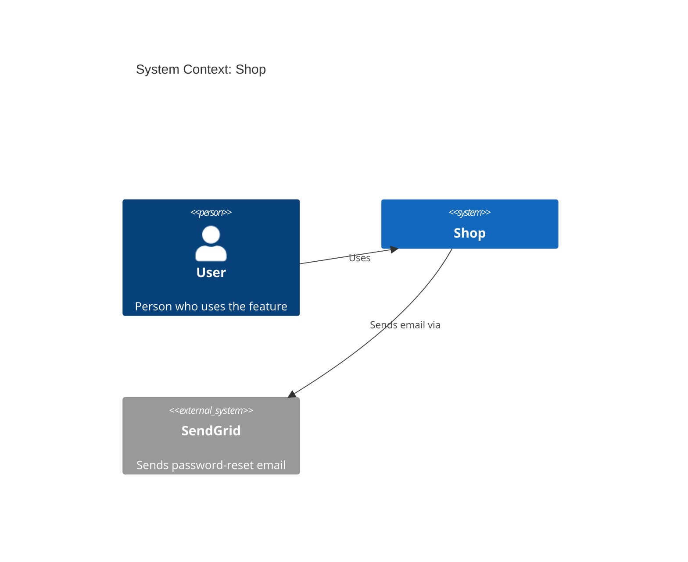
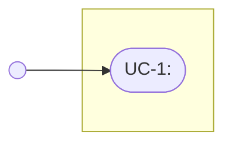
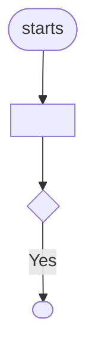

<!-- KingmaDoc 1.2.0 for GitHub Copilot. Generated from skill/SKILL.md by scripts/build_skill_variants.py; do not edit by hand.
     Install as: .github/copilot-instructions.md -->

# KingmaDoc

> These instructions are loaded in every session. Follow them only when the user
> asks to plan, design or scope a feature, or to verify what was built against its
> plan (see [When to use this skill](#when-to-use-this-skill)); otherwise ignore them.

KingmaDoc prevents _code blindness_: the developer (and every later agent session) can
see what a feature is meant to do before it is built, and what was actually built
afterwards, without reading every line of code. You produce two Markdown files per
feature in `docs/features/`: `<slug>-plan.md` and `<slug>-verify.md`.

Contents: [When to use](#when-to-use-this-skill) · [Mode 1: plan](#mode-1-plan) ·
[Mode 2: verify](#mode-2-verify) · [Diagram rules](#diagram-rules) ·
[Output format](#output-format)

## When to use this skill

| Mode       | Use when the user…                                                                     | Output                           |
| ---------- | -------------------------------------------------------------------------------------- | -------------------------------- |
| **plan**   | wants to build, add, design or scope a feature and no code has been written for it yet | `docs/features/<slug>-plan.md`   |
| **verify** | has implemented (part of) a planned feature and wants to know if it matches the plan   | `docs/features/<slug>-verify.md` |

- If the user asks to implement a feature and no plan exists, run **plan** first and
  get approval before changing code.
- If the user says "check", "verify", "review against the plan" or names an existing
  `*-plan.md`, run **verify**.
- If it is unclear which mode is meant, ask one short question.

Ground rules for both modes:

- **Never invent facts.** Everything you derive from the code is marked _(inferred)_;
  everything only the human can know is a `_TODO: …_` placeholder or an open question.
- **Do not change source code** in either mode. You only write the two doc files.
- **Never delete** existing feature docs. If the target file exists, ask before
  overwriting it.
- If the `kingmadoc` command is on `PATH` (`command -v kingmadoc`), prefer it for the
  deterministic parts (see the steps). The docs must look the same either way.

## Mode 1: plan

### Step 1. Read the configuration

Read `.featuredoc.yml` in the project root if it exists. Use these keys (defaults in
brackets); ignore the file if it is absent:

- `output_dir` [`docs/features`]: where docs are written.
- `max_questions` [`5`]: number of clarifying questions (never more than 5).
- `project.name` [project directory name] and `project.description` [empty].
- `analyzer.exclude_dirs` [`.git`, `node_modules`, `.venv`, `venv`, `__pycache__`,
  `dist`, `build`, `*.egg-info`, tool caches], `analyzer.max_files` [`5000`],
  `analyzer.tree_depth` [`3`].
- `diagrams` [`c4_context`, `c4_container`, `class`, `sequence`]: which sections get
  a diagram.
- `diagrams_png` [`embed`]: `embed`, `file` or `off`; see
  [Rendering](#rendering).
- `language` [`en`]: language of fixed sentences, notes and captions (headings stay English).
- `extra_designs.functional_design.enabled` / `extra_designs.technical_design.enabled`
  [`false`]: also write a functional and/or technical design doc. By default only the
  plan is written. The request decides directly, without asking back: "FO and TO",
  "FO/TO", "functional and technical design", "split" → both; "only an FO" → the
  functional design; "only a TO" → the technical design (CLI: `--documents split`,
  `functional` or `technical`).
- `extra_designs.<doc>.models` [all]: which models a doc contains. Functional (for
  stakeholders, plain words): `user_stories`, `use_case_diagram`, `use_cases`,
  `screen_designs`, `evil_user_stories`, `user_flows`. Technical (developers only):
  `business_rules`, `permissions`, `edge_cases`, `threat_model`, `dependency_graph`. Models the user names in the request
  win ("only user stories and screens"); with the CLI pass them as `--models a,b`, which
  also switches on the docs that have them.

### Step 2. Analyze the codebase

If `kingmadoc` is installed, run `kingmadoc analyze --json` and use its output for this
step. Otherwise use file search and text search (never read the whole codebase):

1. **Files.** List files matching `**/*`, skipping the excluded directories. Stop at `max_files`
   and note in the appendix that the analysis is truncated.
2. **Languages.** Count files per extension: `.py` python, `.js/.jsx/.mjs` javascript,
   `.ts/.tsx` typescript, `.go` go, `.rs` rust, `.java` java, `.kt` kotlin, `.rb` ruby,
   `.php` php, `.cs` csharp, `.vb` vb, `.ps1` powershell, `.sql` sql, `.xml` xml,
   `.sh` shell, `.cshtml` razor, `.md` markdown, `.json` json, `.toml` toml,
   `.yml/.yaml` yaml, and so on. Sort by count, highest first.
3. **Top-level directories** that contain files.
4. **Entry points**: files named `main.py`, `app.py`, `__main__.py`, `manage.py`,
   `wsgi.py`, `asgi.py`, `server.py`, `index.{js,ts,tsx}`, `main.{js,ts,tsx,go,rs}`,
   `app.{js,ts}`, `server.{js,ts}`, `Program.cs`, `Main.java`, outside test directories.
5. **Config files** at most two directories deep: `pyproject.toml`, `setup.py`,
   `requirements.txt`, `package.json`, `tsconfig.json`, `go.mod`, `Cargo.toml`,
   `pom.xml`, `build.gradle*`, `Gemfile`, `composer.json`, `*.csproj`, `Dockerfile`,
   `docker-compose.y*ml`, `compose.y*ml`.
6. **Test directories**: outermost directories named `tests`, `test`, `__tests__`,
   `spec` or `specs`.
7. **Stack.** Read the config files and list languages, frameworks and services from
   their dependencies, e.g. `fastapi` → FastAPI, `django` → Django, `react` → React,
   `express` → Express, `psycopg2`/`asyncpg`/`pg`/`github.com/jackc/pgx` or a
   `postgres` image → PostgreSQL, `redis` → Redis, `mongo*` → MongoDB. Confirm
   frameworks with a text search on imports (e.g. `^\s*(from|import)\s+fastapi`). Only list
   what you actually found.
8. **Containers** for the C4 Container diagram: directories with source code
   (`src/<pkg>` counts as `<pkg>`; skip `tests`, `docs`, `examples`, `scripts`, hidden
   directories), at most 6. Technology: first the project files (`.csproj` → C#,
   `.vbproj` → VB.NET, `package.json` → JavaScript/TypeScript, `pyproject.toml` →
   Python), only then the most common extension inside, not counting test data and
   fixtures. If there are none, use one container named after the project, described
   as "Main application".
9. **Open changes**: `git status --short` and `git stash list`; note the ones that
   touch the feature (see the plan format's Appendix).

### Step 3. Ask clarifying questions

Ask the user these questions (at most `max_questions`, in this order), all in one
message, and say they may skip any:

1. What problem does this feature solve, and for whom?
2. Who or what triggers it (end user, scheduled job, external system, ...)?
3. Which external systems, services, or data stores does it interact with?
4. Which existing modules will change? (mention the detected containers)
5. How will you know it works? List the acceptance criteria.

Answers already in the conversation or the request are filled in as a proposal
("Proposal: … — is this right?"), so the user only confirms or corrects them.
If you cannot ask (non-interactive run), or the user skips a question, list it under
**Open questions** instead. Use the answers to fill in scope, assumptions, risks and
the diagrams, but never beyond what the user said or the code shows.

### Step 4. Generate the Feature Design Doc

- **Summary**: the first sentence (ends at `.`/`!`/`?` + capital letter, never at e.g./i.e./etc./vs./cf./approx.),
  whitespace collapsed, at most 120 characters (cut at a word boundary and end with `…`).
- **Slug**: the summary transliterated to ASCII (é→e), lowercase kebab-case, at most 40 characters at a word
  boundary; if non-Latin text leaves nothing, `feature-` + first 8 hex of its SHA-256.
  Example: "Add password reset via email. Links expire…" → `add-password-reset-via-email`.
- Fill every section of the [plan format](#plan-doc-docsfeaturesslug-planmd) in order.
  Scope, assumptions and risks come from the user's answers; anything not covered stays
  a `_TODO: …_` line. Add answered questions under "Answered while planning".
- **Frontmatter** first (`---` YAML): `kingmadoc: 1`, `feature: <slug>`, `status: draft`,
  `requirements` listing every ID of the Requirements section, and `files_expected` with
  the existing files or folders from answer 4 (`[]` if none). Tools read this block.
- **Requirements**: each acceptance criterion from answer 5 becomes `- **REQ-n**:` in EARS
  (`WHEN <trigger> THE SYSTEM SHALL <response>`, `IF <condition> THEN THE SYSTEM SHALL …`),
  numbered from 1; none given: one `_TODO_` requirement. A vague criterion ("all tests
  pass"): propose concrete EARS requirements and ask for confirmation, rather than one
  vague REQ or invented ones. Under each: `Verified by: <test, test case or command>`
  (or `_TODO_`).
- **Planned changes**: per `files_expected` path what changes and why (the "how" of
  answer 4), one to three lines, no code blocks; where a code snippet would help
  (a new method, a changed signature), draw a small `classDiagram` with just those members. Risks and assumptions may add code
  findings marked _(inferred)_.
- **Generated**: the real system time (`date -Iminutes`).
- External systems: those from answer 3, plus systems the code demonstrably uses
  (the latter marked _(inferred)_ below the diagram), as `System_Ext` in the Context
  diagram.
- Follow the [diagram rules](#diagram-rules).

### Step 5. Write the file and ask for approval

1. Write `<output_dir>/<slug>-plan.md` (ask first if it exists). For each enabled
   extra design, also write `<slug>-functional-design.md`
   ([format](#functional-design-doc-docsfeaturesslug-functional-designmd)) and/or
   `<slug>-technical-design.md`
   ([format](#technical-design-doc-docsfeaturesslug-technical-designmd)), in that
   order. Fill in only what the answers and code support; leave the rest as TODOs.
   In the functional design, keep the red thread: one user story per requirement, and
   per story its use case, screen design (a screenshot when the screen already exists)
   and evil user stories, each pointing at a security measure `SM-n` in the technical
   design's threat model. That threat model follows the Microsoft Threat Modeling Tool;
   with the CLI, `kingmadoc threats <file>.yml` generates its threats.
2. Show the paths and a three-line summary (scope, biggest risk, open questions count);
   do not paste the plan into the chat, and do not narrate while you work.
3. Ask the user to reply **yes** (approve), **edit <changes>**, or **stop**. On
   **edit**, update the doc and ask again. On **yes**, run `kingmadoc approve <slug>`
   (with the CLI; otherwise set `status: approved` in the frontmatter and **Status** to
   `Approved`). With the CLI, `kingmadoc check <slug>` validates the plan first.
   Do not change any source code before the plan is approved.

## Mode 2: verify

With the CLI, start with `kingmadoc verify <slug>`: it writes the verify doc with the
changed files, scope and requirement deviations, and sets the plan's status. Add
`--run-checks` only when the user agrees to run the project's commands. Then go through
the steps below to add what it cannot see (behaviour, assumptions, risks).

### Step 1. Find the plan

- If the user gave a slug, use `<output_dir>/<slug>-plan.md`. If they gave a path or a
  feature name, derive the slug from it.
- If no slug was given, list `<output_dir>/*-plan.md`. One match: use it. Several:
  ask which one. None: stop and tell the user to run plan mode first.
- If the plan file does not exist, say so, list the slugs that do exist, and stop.
  Do not write a verify doc without a plan.

### Step 2. Read the actual code

1. Read the whole plan doc: its frontmatter (`requirements`, `files_expected`), scope,
   requirements, assumptions, risks, both diagrams, open questions.
2. Find what changed for this feature: `git log --since="<Generated date>" --stat`
   and `git diff` (including uncommitted changes). Without git, use the modules named
   in the plan and the containers in the C4 Container diagram.
3. Read the changed files and the modules the plan says will change. Read only what is
   needed to judge each plan item; do not summarize unrelated code.

### Step 3. Compare and list deviations

Check each item and record every mismatch as a deviation:

- **Scope**: every in-scope item is implemented; no out-of-scope item was built.
- **Requirements**: each `REQ-n` is met (name the code or test), partly met, or not met.
  Files in `files_expected` that were never touched are deviations too.
- **Architecture**: containers and external systems in the code match the C4
  diagrams (new services, databases, queues or APIs count as deviations), and the
  built classes and calls match the class and sequence diagrams (Area: Architecture).
  If the diagrams in the plan changed, render them again.
- **Assumptions**: still true in the code (e.g. "uses the existing auth module").
- **Risks**: each risk is mitigated, accepted, or still open.
- **Open questions**: resolved by the implementation, or still open.

Then run the project's checks, if you can find them (config files, `Makefile`,
`package.json` scripts, CI config): build, tests, lint. Record the exact command and
the result. If a check cannot be run, write `_not run_` and the reason. Never claim a
check passed without running it.

### Step 4. Write the Feature Verification Doc

Write `<output_dir>/<slug>-verify.md` next to the plan in the
[verify format](#verify-doc-docsfeaturesslug-verifymd) (ask first if it exists). Set
**Status** to `Matches plan`, `Deviations found`, or `Not verified` (when checks could
not run). Diagrams in the verify doc follow the same `diagrams_png` mode as the plan.
Show the user the path, the number of deviations, and any failing check.

## Diagram rules

- **Always Mermaid** (ignore `diagram_format`; PlantUML/D2 are CLI-only). Mermaid is
  the source of truth; every diagram is also rendered to a PNG and embedded in the
  Markdown (see [Rendering](#rendering)).
- **Always complete**: every diagram is a complete Mermaid diagram (a ` ```mermaid `
  block, or its `.mmd` file once rendered), with nothing else in it.
- **Always labeled**:
  - C4 and `sequenceDiagram`: the first line after the diagram type is `title <text>`
    (`System Context: <project>`, `Containers: <project>`);
  - `classDiagram`, `erDiagram` and `flowchart` have no `title` line; put frontmatter
    before the diagram type instead: `---`, `title: "<text>"`, `---` (quote the
    title: an unquoted `:` breaks the YAML and the render);
  - every element has a quoted label: `Person(alias, "Label", "Description")`,
    `System(alias, "Label", "Description")`, `System_Ext(…)`,
    `Container(alias, "Label", "Technology", "Description")`. Omit an unknown
    description on `Person`/`System`/`System_Ext` rather than guessing; on a
    `Container`, write `""` for unknown technology or description;
  - every relationship is `Rel(from, to, "Label")` with a verb label ("Uses",
    "Reads/writes", "Sends email via").
- **Aliases**: lowercase, `[a-z0-9_]`, unique per diagram (`api`, `api_2`). A
  `System_Boundary` alias ends in `_boundary` and is never used in `Rel`.
- **Escaping**: inside quoted labels write `"` as `#quot;`. In titles, leave quotes as
  they are and drop `#` and `;` (they end a C4 title). Put everything on one line.
- **Colour**: the normal Mermaid theme. No `style`, `classDef` or `%%{init}%%` colours in
  UML (class, sequence) diagrams; colour only to make one thing stand out, such as the
  changed containers below.
- **Short labels**: about 50 characters at most; split a long message in two.
- **Sequence aliases**: never `x`, `X`, `o` or `O` (they clash with the `-x` and `-o`
  arrows); use abbreviations of two or more letters (`ct`, `svc`).
- **Inferred content**: anything derived from the code (containers, technologies)
  must be marked _(inferred)_ in the text around the diagram. Do not add systems nobody
  mentioned and the code does not show.
- **External systems** (Context diagram): the systems from answer 3, plus systems the
  code demonstrably uses; the latter are marked _(inferred)_ in the text below the
  diagram.
- **Changed containers**: in the Container diagram, mark each container the feature
  touches with `UpdateElementStyle(<alias>, $bgColor="#d9822b")` or `(changes)` at the
  end of its description.
- **Container diagram layout**: the `System_Boundary` holds the containers; the `User`
  person sits outside it, with `Rel(user, <first container>, "Uses")`.

Example (C4 Context):



`diagrams` in `.featuredoc.yml` [`c4_context`, `c4_container`, `class`, `sequence`]
selects the diagrams. If one is disabled, keep its section and replace the diagram with
this line: _Disabled in `.featuredoc.yml` (`diagrams`)._

## Rendering

`diagrams_png` in `.featuredoc.yml` [`embed`]: `embed` (below), `file` (the PNG goes to
`<output_dir>/img/<slug>-<diagram>.png`, linked with ``)
or `off` (no image; the ` ```mermaid ` block stays in the document).

- **Mode comes only from `.featuredoc.yml`.** No file or no `diagrams_png` key → `embed`.
  Never infer the mode from existing files (an `img/` folder, how an earlier doc did it).
- **Check before you finish:** in `embed` mode every image line starts with
  `, never by hand.
- **No Mermaid source in the document** once its PNG is there: no ` ```mermaid ` block
  and no `<details>` with the source. The source lives in
  `<output_dir>/diagrams/<slug>-<diagram>.mmd`.

1. Write each diagram to `<output_dir>/diagrams/<slug>-<diagram>.mmd` (`<diagram>`:
   `c4-context`, `c4-container`, `class`, `sequence-current`, `sequence-new`) and run:
   `npx -y @mermaid-js/mermaid-cli -i <that>.mmd -o <tmp>.png -s 2 -b white -t default -p <puppeteer.json>`
   (`-t default`: Mermaid's normal theme; newer versions otherwise colour every shape).
2. Set `PUPPETEER_SKIP_DOWNLOAD=true`, and let `puppeteer.json` point at an installed
   browser, so no Chromium is downloaded:
   `{"executablePath": "C:/Program Files (x86)/Microsoft/Edge/Application/msedge.exe"}`
   (or Chrome). Ask the user once before the first npm download: package
   `@mermaid-js/mermaid-cli`, from the npm registry, about 50 MB with dependencies.
3. In the document, in place of the block, two lines:
   `<!-- kingmadoc:diagram diagrams/<slug>-<diagram>.mmd -->` and
   ``.
   No separate image files go into the repo (`file` mode aside).
4. To change a diagram, edit its `.mmd` file and render again; replace only the image
   line below its comment. (GitHub shows no data-URI images; there the `.mmd` file is
   the readable version.)
5. Look at every PNG after rendering (Read): not empty, no labels cut off at the edge,
   no unexpected extra participants. If needed, fix the Mermaid (split or shorten a
   label) and render again.
6. If rendering fails, keep the ` ```mermaid ` block in the document, write
   `_TODO: PNG not generated: <reason>._` below it (in `language`) and carry on; the
   document stays valid.

## Output format

Use exactly these headings, in this order. Text in `<angle brackets>` is filled in;
`_TODO: …_` lines stay until the human replaces them. These formats match the
`kingmadoc` CLI, so docs from the skill and the CLI are interchangeable.

### Plan doc: `docs/features/<slug>-plan.md`

````markdown
---
kingmadoc: 1
feature: "<slug>"
status: draft
requirements: [REQ-1, <one ID per requirement below>]
files_expected: [<existing files or folders the user said will change>]
---
# Feature: <summary>

|               |                                                                           |
| ------------- | ------------------------------------------------------------------------- |
| **Project**   | <project name>                                                            |
| **Status**    | Draft                                                                     |
| **Generated** | <ISO date and time, e.g. 2026-09-26T14:05+02:00> by KingmaDoc skill 1.2.0 |

> Generated before implementation. Fill in every _TODO_ and review everything marked
> _(inferred)_: it comes from the codebase analysis and is a starting point, not the truth.

## One-sentence summary

<summary>

**Full description:** <full description; omit this line if it equals the summary>

## Scope (in / out)

**In scope**

- <from the answers, or> _TODO: what this feature delivers._

**Out of scope**

- <from the answers, or> _TODO: what it deliberately does not do._

## Planned changes

- `<path from files_expected>`: <what changes and why, one to three lines, no code
  blocks (a small classDiagram with the changed members instead of a snippet); the "how"
  from answer 4, or> _TODO: what changes here and why._

## Requirements

- **REQ-1**: <WHEN <trigger> THE SYSTEM SHALL <response>, from the acceptance criteria, or>
  _TODO: WHEN <trigger> THE SYSTEM SHALL <response>._
  Verified by: <test, test case or command, or> _TODO_

## Assumptions

- _(inferred)_ Built on the existing stack: <stack>.
- <from the answers, or a code finding marked> _(inferred)_
- _TODO: what must be true for this plan to work (users, data, services, limits)._

## Risks

- <from the answers, or a code finding marked> _(inferred)_ <e.g. a shared base class
  other parts also use>
- _TODO: what could go wrong, and how you will notice or limit it._

## C4 Context (Mermaid)

Who uses the system and which external systems it depends on.

<C4Context diagram>

## C4 Container (Mermaid)

The runnable units inside the system _(inferred from source directories)_.

<C4Container diagram; containers the feature touches are marked>

## Class diagram (Mermaid)

The classes this feature touches and their direct collaborators.

<classDiagram>

## Sequence diagram (Mermaid)

### Current (inferred)

<sequenceDiagram of today's flow, with the place where it goes wrong as a Note>

### New

<sequenceDiagram of the flow after the change>

## Open questions

- [ ] <each unanswered clarifying question>
- [ ] _TODO: anything else that must be decided before implementation._

**Answered while planning**

- **<question>** <answer>

## Appendix: codebase context _(inferred)_

- **Tech stack:** <stack, or _not detected_>
- **Entry points:** <`path`, … or _none found_>
- **Config files:** <`path`, … or _none found_>
- **Test directories:** <`path`, … or _none found_>
- **Open changes:** <`git status --short` / `git stash list` entries that touch the
  feature, or _none_>

| Language   | Files   |
| ---------- | ------- |
| <language> | <count> |

<details>
<summary>File tree (<n> files)</summary>

```text
<tree, max tree_depth levels; deeper content shown as …>
```

</details>
````

Omit "**Answered while planning**" when nothing was answered.

- Every diagram is its PNG, with the Mermaid source in a `.mmd` file (see
  [Rendering](diagram-rules.md#rendering)); a disabled diagram keeps its section with
  _Disabled in `.featuredoc.yml` (`diagrams`)._
- **Generated** is the real system time (`date -Iminutes`), never a guess.
- **Class diagram**: a `classDiagram` of the classes the feature touches and their
  direct collaborators (inherits, calls, creates), with only the relevant members.
  `<<changed>>` on existing classes that change, `<<new>>` on new ones, and a `note for
  <Class>` saying what is new or changed. Existing classes and relations come from the
  code and are _(inferred)_; new ones only when the user or "Planned changes" name them.
- **Sequence diagram**: two diagrams, from the entry point (a test or command) to the
  result, with real classes as participants and real method names as messages;
  `activate`/`deactivate` for nested calls, `alt`/`opt` for branches. In **Current**,
  a `Note` marks where it goes wrong.
- **Open changes**: when an uncommitted change or stash touches the feature, also list
  it under Open questions.
- `language` in `.featuredoc.yml` [`en`]: headings stay English (the CLI's), but fixed
  sentences, notes and captions are written in that language.

File tree example (`tree_depth: 3`; `…` indented under every cut-off folder):

```text
shop/
  src/
    shop/
      …
  tests/
    unit/
      …
    conftest.py
  pyproject.toml
```

### Functional design doc: `docs/features/<slug>-functional-design.md`

Only when enabled. Same header table as the plan, with a **Plan** row linking
`<slug>-plan.md`. It describes _what_ the feature does for users, not how it is built,
along one red thread: every user story **US-n** gets a use case **UC-n**, a screen
design **S-n** and evil user stories **EUS-n.m**; each evil user story names the
security measure **SM-n** that stops it, listed in the technical design's threat model.
The screen is a screenshot of the running app when it already exists
(`img/screen-us-<n>.png`), otherwise a text wireframe. One user story
per requirement (`Covers: REQ-n`), or one `_TODO_` story when there are none; repeat the
`### US-n` block per story and add each story to the use case diagram.

````markdown
# Functional design: <summary>

## User stories

| ID | As a … | I want … | So that … | Covers |
|---|---|---|---|---|
| US-1 | <role> | <goal> | <benefit> | REQ-1 |

## Use case diagram



## Per user story

### US-1: <short title>

- **Covers:** REQ-1: <requirement>

#### Use case

| UC-1 | |
|---|---|
| **Actor** | <role> |
| **Precondition** | <what is true before> |
| **Main flow** | 1. <the actor …> 2. <the system …> |
| **Alternative flows** | <2a. … → …> |
| **Postcondition** | <what is true afterwards> |

#### Screen design

S-1: <the screen, command, API response or e-mail the actor uses in UC-1>

```text
+--------------------------------------+
| <screen title>                 [ X ] |
| <label>   [ <input>              ]   |
| ! <error message>                    |
|                 [ Cancel ]  [ <OK> ] |
+--------------------------------------+
```

#### Evil user stories

| ID | As a malicious … I want … so that … | Threat (STRIDE) | Mitigation |
|---|---|---|---|
| EUS-1.1 | <misuse of US-1> | <STRIDE threat> | <SM-n> |

## User flows


````

### Technical design doc: `docs/features/<slug>-technical-design.md`

Only when enabled. Same header table as the plan (with the **Plan** row), then:

````markdown
# Technical design: <summary>

## Database schema

- _(inferred)_ Data stores detected in the codebase: <stores, or "No database detected">.
- _TODO: tables or collections, keys, indexes, migrations and rollback._

```mermaid
erDiagram
    <ENTITY> ||--o{ <ENTITY> : "<label>"
```

## API contracts

| Method / type | Path / name | Request | Response | Errors |
|---|---|---|---|---|

## Business rules

| Rule | What it enforces | Where (layer, `path`) | Test |
|---|---|---|---|
| BR-1 | <rule> (source: <who decided it>) | <layer, `path`> | <test> |

## Permissions and roles

| Role | <endpoint or action> |
|---|---|
| <role> | <allowed / denied / condition> |

## Edge cases

| Situation | Expected behavior | Where handled | Test |
|---|---|---|---|

## Error handling

## Performance considerations

## Security considerations

## Threat model

| Element | Stencil | Trust boundary |
|---|---|---|
| <User> | <External Interactor (Human User) / Process / Data Store> | <outside / Internet Boundary / …> |

| Not Started | Not Applicable | Needs Investigation | Mitigation Implemented | Total |
|---|---|---|---|---|
| <count> | <count> | <count> | <count> | <count> |

### Interaction: <flow name> (<source> → <target>)

| # | Threat | Category | Description | State | Priority | Justification |
|---|---|---|---|---|---|---|
| 1 | Spoofing the <source> External Entity | Spoofing | <description> | <state> | <High / Medium / Low> | <SM-n, or why not applicable> |

### Security measures

| ID | Measure | Stops | Test |
|---|---|---|---|
| SM-1 | <measure> | <threat #, EUS-n.m> | <test> |

## Dependency graph
````

The threat model follows the Microsoft Threat Modeling Tool (template SDL TM Knowledge
Base): the tool's stencils, then per data flow that crosses a trust boundary one table
with its STRIDE threats (the tool's titles, e.g. "Spoofing the <source> External
Entity", "Potential Lack of Input Validation for <target>", "Potential Data Repudiation
by <target>", "Data Flow Sniffing", "Potential Process Crash or Stop for <target>",
"Elevation Using Impersonation"), a state (Not Started, Not Applicable, Needs
Investigation, Mitigation Implemented), a priority and a justification naming the
`SM-n`. The functional design's evil user stories go under the interaction they misuse. Each section lists `_TODO: …_` bullets for what is not yet known; the dependency graph is a class diagram of imports between the project's own modules, marked _(inferred)_.

### Verify doc: `docs/features/<slug>-verify.md`

```markdown
# Verification: <slug>

|               |                                                  |
| ------------- | ------------------------------------------------ |
| **Plan**      | [`<output_dir>/<slug>-plan.md`](<slug>-plan.md)  |
| **Status**    | <Matches plan / Deviations found / Not verified> |
| **Generated** | <ISO date and time> by KingmaDoc skill 1.2.0     |

> Verified by an AI agent against the code at <commit hash, or "uncommitted changes">.
> Review every deviation; the agent reports, it does not decide.

## Deviations

| #   | Area                                                       | Plan says          | Code does                              | Impact                |
| --- | ---------------------------------------------------------- | ------------------ | -------------------------------------- | --------------------- |
| 1   | <Scope / Architecture / Assumption / Risk / Open question> | <quote or summary> | <what the code does, with `path:line`> | <High / Medium / Low> |

<or, if there are none:> _No deviations found._

## Validation results

| Check | Command     | Result                                              |
| ----- | ----------- | --------------------------------------------------- |
| Build | `<command>` | <passed / failed: short reason / _not run_: reason> |
| Tests | `<command>` | <…>                                                 |
| Lint  | `<command>` | <…>                                                 |
```
