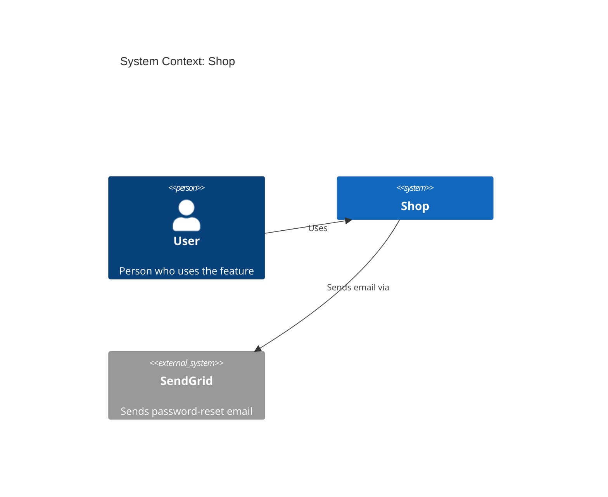

## Diagram rules

- **Always Mermaid** (ignore `diagram_format`; PlantUML/D2 are CLI-only). No images.
- **Always fenced**: every diagram is a complete ` ```mermaid ` … ` ``` `
  block, with nothing else inside it.
- **Always labeled**:
  - the first line after the diagram type is `title <text>`
    (`System Context: <project>`, `Containers: <project>`);
  - every element has a quoted label: `Person(alias, "Label", "Description")`,
    `System(alias, "Label", "Description")`, `System_Ext(…)`,
    `Container(alias, "Label", "Technology", "Description")`. Omit an unknown
    description on `Person`/`System`/`System_Ext` rather than guessing; on a
    `Container`, write `""` for unknown technology or description;
  - every relationship is `Rel(from, to, "Label")` with a verb label ("Uses",
    "Reads/writes", "Sends email via").
- **Aliases**: lowercase, `[a-z0-9_]`, unique per diagram (`api`, `api_2`). A
  `System_Boundary` alias ends in `_boundary` and is never used in `Rel`.
- **Escaping**: inside quoted labels write `"` as `#quot;`. In titles, leave quotes as
  they are and drop `#` and `;` (they end a C4 title). Put everything on one line.
- **Inferred content**: anything derived from the code (containers, technologies)
  must be marked _(inferred)_ in the text around the diagram. Do not add systems nobody
  mentioned and the code does not show.
- **Container diagram layout**: the `System_Boundary` holds the containers; the `User`
  person sits outside it, with `Rel(user, <first container>, "Uses")`.

Example (C4 Context):



If a diagram is disabled in `.featuredoc.yml`, keep its section and replace the
diagram with this line: _Disabled in `.featuredoc.yml` (`diagrams`)._
