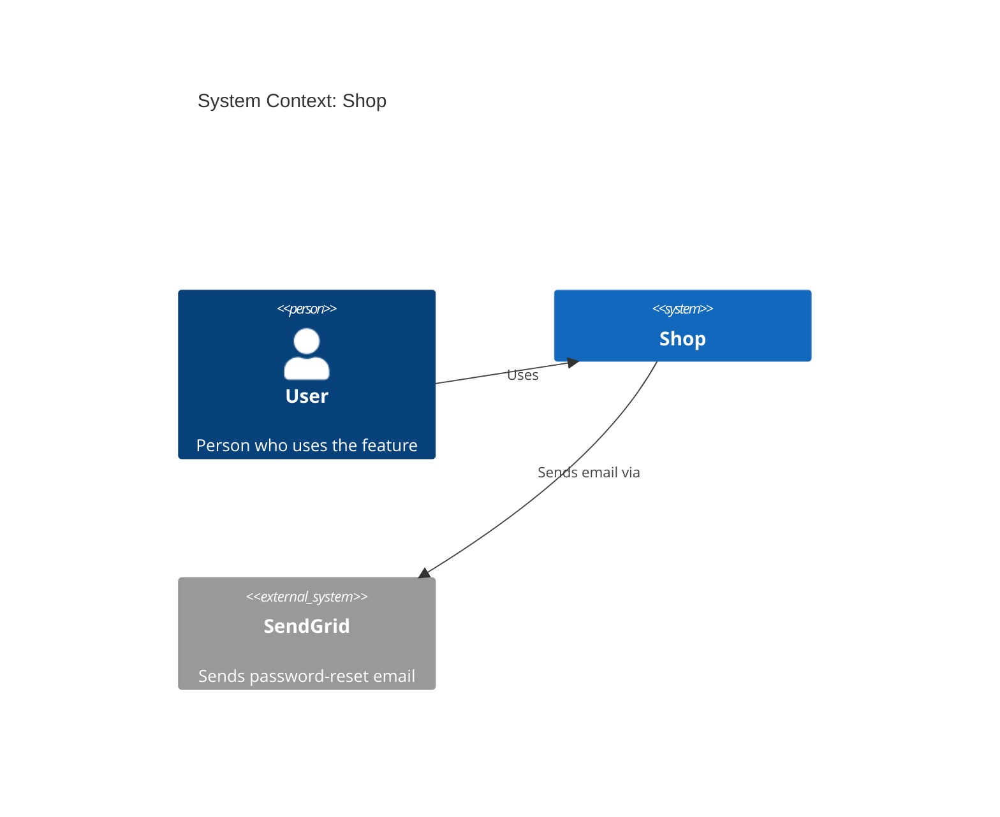

## Diagram rules

- **Always Mermaid** (ignore `diagram_format`; PlantUML/D2 are CLI-only). Mermaid is
  the source of truth; every diagram is also rendered to a PNG and embedded in the
  Markdown (see [Rendering](#rendering)).
- **Always complete**: every diagram is a complete Mermaid diagram (a ` ```mermaid `
  block, or its `.mmd` file once rendered), with nothing else in it.
- **Always labeled**:
  - C4 and `sequenceDiagram`: the first line after the diagram type is `title <text>`
    (`System Context: <project>`, `Containers: <project>`);
  - `classDiagram`, `erDiagram` and `flowchart` have no `title` line; put frontmatter
    before the diagram type instead: `---`, `title: "<text>"`, `---` (quote the
    title: an unquoted `:` breaks the YAML and the render);
  - every element has a quoted label: `Person(alias, "Label", "Description")`,
    `System(alias, "Label", "Description")`, `System_Ext(…)`,
    `Container(alias, "Label", "Technology", "Description")`. Omit an unknown
    description on `Person`/`System`/`System_Ext` rather than guessing; on a
    `Container`, write `""` for unknown technology or description;
  - every relationship is `Rel(from, to, "Label")` with a verb label ("Uses",
    "Reads/writes", "Sends email via").
- **Aliases**: lowercase, `[a-z0-9_]`, unique per diagram (`api`, `api_2`). A
  `System_Boundary` alias ends in `_boundary` and is never used in `Rel`.
- **Escaping**: inside quoted labels write `"` as `#quot;`. In titles, leave quotes as
  they are and drop `#` and `;` (they end a C4 title). Put everything on one line.
- **Colour**: the normal Mermaid theme. No `style`, `classDef` or `%%{init}%%` colours in
  UML (class, sequence) diagrams; colour only to make one thing stand out, such as the
  changed containers below.
- **Short labels**: about 50 characters at most; split a long message in two.
- **Sequence aliases**: never `x`, `X`, `o` or `O` (they clash with the `-x` and `-o`
  arrows); use abbreviations of two or more letters (`ct`, `svc`).
- **Inferred content**: anything derived from the code (containers, technologies)
  must be marked _(inferred)_ in the text around the diagram. Do not add systems nobody
  mentioned and the code does not show.
- **External systems** (Context diagram): the systems from answer 3, plus systems the
  code demonstrably uses; the latter are marked _(inferred)_ in the text below the
  diagram.
- **Changed containers**: in the Container diagram, mark each container the feature
  touches with `UpdateElementStyle(<alias>, $bgColor="#d9822b")` or `(changes)` at the
  end of its description.
- **Container diagram layout**: the `System_Boundary` holds the containers; the `User`
  person sits outside it, with `Rel(user, <first container>, "Uses")`.

Example (C4 Context):



`diagrams` in `.featuredoc.yml` [`c4_context`, `c4_container`, `class`, `sequence`]
selects the diagrams. If one is disabled, keep its section and replace the diagram with
this line: _Disabled in `.featuredoc.yml` (`diagrams`)._

## Rendering

`diagrams_png` in `.featuredoc.yml` [`embed`]: `embed` (below), `file` (the PNG goes to
`<output_dir>/img/<slug>-<diagram>.png`, linked with ``)
or `off` (no image; the ` ```mermaid ` block stays in the document).

- **Mode comes only from `.featuredoc.yml`.** No file or no `diagrams_png` key → `embed`.
  Never infer the mode from existing files (an `img/` folder, how an earlier doc did it).
- **Check before you finish:** in `embed` mode every image line starts with
  `, never by hand.
- **No Mermaid source in the document** once its PNG is there: no ` ```mermaid ` block
  and no `<details>` with the source. The source lives in
  `<output_dir>/diagrams/<slug>-<diagram>.mmd`.

1. Write each diagram to `<output_dir>/diagrams/<slug>-<diagram>.mmd` (`<diagram>`:
   `c4-context`, `c4-container`, `class`, `sequence-current`, `sequence-new`) and run:
   `npx -y @mermaid-js/mermaid-cli -i <that>.mmd -o <tmp>.png -s 2 -b white -t default -p <puppeteer.json>`
   (`-t default`: Mermaid's normal theme; newer versions otherwise colour every shape).
2. Set `PUPPETEER_SKIP_DOWNLOAD=true`, and let `puppeteer.json` point at an installed
   browser, so no Chromium is downloaded:
   `{"executablePath": "C:/Program Files (x86)/Microsoft/Edge/Application/msedge.exe"}`
   (or Chrome). Ask the user once before the first npm download: package
   `@mermaid-js/mermaid-cli`, from the npm registry, about 50 MB with dependencies.
3. In the document, in place of the block, two lines:
   `<!-- kingmadoc:diagram diagrams/<slug>-<diagram>.mmd -->` and
   ``.
   No separate image files go into the repo (`file` mode aside).
4. To change a diagram, edit its `.mmd` file and render again; replace only the image
   line below its comment. (GitHub shows no data-URI images; there the `.mmd` file is
   the readable version.)
5. Look at every PNG after rendering (Read): not empty, no labels cut off at the edge,
   no unexpected extra participants. If needed, fix the Mermaid (split or shorten a
   label) and render again.
6. If rendering fails, keep the ` ```mermaid ` block in the document, write
   `_TODO: PNG not generated: <reason>._` below it (in `language`) and carry on; the
   document stays valid.
