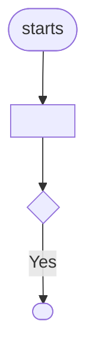

## Output format

Use exactly these headings, in this order. Text in `<angle brackets>` is filled in;
`_TODO: …_` lines stay until the human replaces them. These formats match the
`kingmadoc` CLI, so docs from the skill and the CLI are interchangeable.

### Plan doc: `docs/features/<slug>-plan.md`

````markdown
---
kingmadoc: 1
feature: <slug>
status: draft
requirements: [REQ-1, <one ID per requirement below>]
files_expected: [<existing files or folders the user said will change>]
---
# Feature: <summary>

|               |                                                                           |
| ------------- | ------------------------------------------------------------------------- |
| **Project**   | <project name>                                                            |
| **Status**    | Draft                                                                     |
| **Generated** | <ISO date and time, e.g. 2026-09-26T14:05+02:00> by KingmaDoc skill 1.1.0 |

> Generated before implementation. Fill in every _TODO_ and review everything marked
> _(inferred)_: it comes from the codebase analysis and is a starting point, not the truth.

## One-sentence summary

<summary>

**Full description:** <full description; omit this line if it equals the summary>

## Scope (in / out)

**In scope**

- <from the answers, or> _TODO: what this feature delivers._

**Out of scope**

- <from the answers, or> _TODO: what it deliberately does not do._

## Requirements

- **REQ-1**: <WHEN <trigger> THE SYSTEM SHALL <response>, from the acceptance criteria, or>
  _TODO: WHEN <trigger> THE SYSTEM SHALL <response>._

## Assumptions

- _(inferred)_ Built on the existing stack: <stack>.
- _TODO: what must be true for this plan to work (users, data, services, limits)._

## Risks

- _TODO: what could go wrong, and how you will notice or limit it._

## C4 Context (Mermaid)

Who uses the system and which external systems it depends on.

<C4Context diagram>

## C4 Container (Mermaid)

The runnable units inside the system _(inferred from source directories)_.

<C4Container diagram>

## Open questions

- [ ] <each unanswered clarifying question>
- [ ] _TODO: anything else that must be decided before implementation._

**Answered while planning**

- **<question>** <answer>

## Appendix: codebase context _(inferred)_

- **Tech stack:** <stack, or _not detected_>
- **Entry points:** <`path`, … or _none found_>
- **Config files:** <`path`, … or _none found_>
- **Test directories:** <`path`, … or _none found_>

| Language   | Files   |
| ---------- | ------- |
| <language> | <count> |

<details>
<summary>File tree (<n> files)</summary>

```text
<tree, max tree_depth levels; deeper content shown as …>
```

</details>
````

Omit "**Answered while planning**" when nothing was answered.

### Functional design doc: `docs/features/<slug>-functional-design.md`

Only when enabled. Same header table as the plan, with a **Plan** row linking
`<slug>-plan.md`. It describes _what_ the feature does for users, not how it is built:

````markdown
# Functional design: <summary>

## User flows



## Edge cases

| Situation | Expected behavior |
|---|---|

## Business rules

- **BR-1:** <rule> (source: <who decided it>)

## Permissions and roles

| Role | Can | Cannot |
|---|---|---|
````

### Technical design doc: `docs/features/<slug>-technical-design.md`

Only when enabled. Same header table as the plan (with the **Plan** row), then:

````markdown
# Technical design: <summary>

## Database schema

- _(inferred)_ Data stores detected in the codebase: <stores, or "No database detected">.
- _TODO: tables or collections, keys, indexes, migrations and rollback._

```mermaid
erDiagram
    <ENTITY> ||--o{ <ENTITY> : "<label>"
```

## API contracts

| Method / type | Path / name | Request | Response | Errors |
|---|---|---|---|---|

## Error handling

## Performance considerations

## Security considerations

## Dependency graph
````

Each section lists `_TODO: …_` bullets for what is not yet known; the dependency graph is a class diagram of imports between the project's own modules, marked _(inferred)_.

### Verify doc: `docs/features/<slug>-verify.md`

```markdown
# Verification: <slug>

|               |                                                  |
| ------------- | ------------------------------------------------ |
| **Plan**      | [`<output_dir>/<slug>-plan.md`](<slug>-plan.md)  |
| **Status**    | <Matches plan / Deviations found / Not verified> |
| **Generated** | <ISO date and time> by KingmaDoc skill 1.1.0     |

> Verified by an AI agent against the code at <commit hash, or "uncommitted changes">.
> Review every deviation; the agent reports, it does not decide.

## Deviations

| #   | Area                                                       | Plan says          | Code does                              | Impact                |
| --- | ---------------------------------------------------------- | ------------------ | -------------------------------------- | --------------------- |
| 1   | <Scope / Architecture / Assumption / Risk / Open question> | <quote or summary> | <what the code does, with `path:line`> | <High / Medium / Low> |

<or, if there are none:> _No deviations found._

## Validation results

| Check | Command     | Result                                              |
| ----- | ----------- | --------------------------------------------------- |
| Build | `<command>` | <passed / failed: short reason / _not run_: reason> |
| Tests | `<command>` | <…>                                                 |
| Lint  | `<command>` | <…>                                                 |
```
