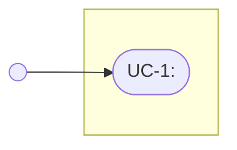

## Output format

Use exactly these headings, in this order. Text in `<angle brackets>` is filled in;
`_TODO: …_` lines stay until the human replaces them. These formats match the
`kingmadoc` CLI, so docs from the skill and the CLI are interchangeable.

### Plan doc: `docs/features/<slug>-plan.md`

````markdown
---
kingmadoc: 1
feature: "<slug>"
status: draft
requirements: [REQ-1, <one ID per requirement below>]
files_expected: [<existing files or folders the user said will change>]
---
# Feature: <summary>

|               |                                                                           |
| ------------- | ------------------------------------------------------------------------- |
| **Project**   | <project name>                                                            |
| **Status**    | Draft                                                                     |
| **Generated** | <ISO date and time, e.g. 2026-09-26T14:05+02:00> by KingmaDoc skill 1.2.0 |

> Generated before implementation. Fill in every _TODO_ and review everything marked
> _(inferred)_: it comes from the codebase analysis and is a starting point, not the truth.

## One-sentence summary

<summary>

**Full description:** <full description; omit this line if it equals the summary>

## Scope (in / out)

**In scope**

- <from the answers, or> _TODO: what this feature delivers._

**Out of scope**

- <from the answers, or> _TODO: what it deliberately does not do._

## Planned changes

- `<path from files_expected>`: <what changes and why, one to three lines, no code
  blocks (a small classDiagram with the changed members instead of a snippet); the "how"
  from answer 4, or> _TODO: what changes here and why._

## Requirements

- **REQ-1**: <WHEN <trigger> THE SYSTEM SHALL <response>, from the acceptance criteria, or>
  _TODO: WHEN <trigger> THE SYSTEM SHALL <response>._
  Verified by: <test, test case or command, or> _TODO_

## Assumptions

- _(inferred)_ Built on the existing stack: <stack>.
- <from the answers, or a code finding marked> _(inferred)_
- _TODO: what must be true for this plan to work (users, data, services, limits)._

## Risks

- <from the answers, or a code finding marked> _(inferred)_ <e.g. a shared base class
  other parts also use>
- _TODO: what could go wrong, and how you will notice or limit it._

## C4 Context (Mermaid)

Who uses the system and which external systems it depends on.

<C4Context diagram>

## C4 Container (Mermaid)

The runnable units inside the system _(inferred from source directories)_.

<C4Container diagram; containers the feature touches are marked>

## Class diagram (Mermaid)

The classes this feature touches and their direct collaborators.

<classDiagram>

## Sequence diagram (Mermaid)

### Current (inferred)

<sequenceDiagram of today's flow, with the place where it goes wrong as a Note>

### New

<sequenceDiagram of the flow after the change>

## Open questions

- [ ] <each unanswered clarifying question>
- [ ] _TODO: anything else that must be decided before implementation._

**Answered while planning**

- **<question>** <answer>

## Appendix: codebase context _(inferred)_

- **Tech stack:** <stack, or _not detected_>
- **Entry points:** <`path`, … or _none found_>
- **Config files:** <`path`, … or _none found_>
- **Test directories:** <`path`, … or _none found_>
- **Open changes:** <`git status --short` / `git stash list` entries that touch the
  feature, or _none_>

| Language   | Files   |
| ---------- | ------- |
| <language> | <count> |

<details>
<summary>File tree (<n> files)</summary>

```text
<tree, max tree_depth levels; deeper content shown as …>
```

</details>
````

Omit "**Answered while planning**" when nothing was answered.

- Every diagram is its PNG, with the Mermaid source in a `.mmd` file (see
  [Rendering](diagram-rules.md#rendering)); a disabled diagram keeps its section with
  _Disabled in `.featuredoc.yml` (`diagrams`)._
- **Generated** is the real system time (`date -Iminutes`), never a guess.
- **Class diagram**: a `classDiagram` of the classes the feature touches and their
  direct collaborators (inherits, calls, creates), with only the relevant members.
  `<<changed>>` on existing classes that change, `<<new>>` on new ones, and a `note for
  <Class>` saying what is new or changed. Existing classes and relations come from the
  code and are _(inferred)_; new ones only when the user or "Planned changes" name them.
- **Sequence diagram**: two diagrams, from the entry point (a test or command) to the
  result, with real classes as participants and real method names as messages;
  `activate`/`deactivate` for nested calls, `alt`/`opt` for branches. In **Current**,
  a `Note` marks where it goes wrong.
- **Open changes**: when an uncommitted change or stash touches the feature, also list
  it under Open questions.
- `language` in `.featuredoc.yml` [`en`]: headings stay English (the CLI's), but fixed
  sentences, notes and captions are written in that language.

File tree example (`tree_depth: 3`; `…` indented under every cut-off folder):

```text
shop/
  src/
    shop/
      …
  tests/
    unit/
      …
    conftest.py
  pyproject.toml
```

### Functional design doc: `docs/features/<slug>-functional-design.md`

Only when enabled. Same header table as the plan, with a **Plan** row linking
`<slug>-plan.md`. It describes _what_ the feature does for users, not how it is built,
along one red thread: every user story **US-n** gets a use case **UC-n**, a screen
design **S-n** and evil user stories **EUS-n.m**; each evil user story names the
security measure **SM-n** that stops it, listed in the technical design's threat model.
The screen is a screenshot of the running app when it already exists
(`img/screen-us-<n>.png`), otherwise a text wireframe. One user story
per requirement (`Covers: REQ-n`), or one `_TODO_` story when there are none; repeat the
`### US-n` block per story and add each story to the use case diagram.

````markdown
# Functional design: <summary>

## User stories

| ID | As a … | I want … | So that … | Covers |
|---|---|---|---|---|
| US-1 | <role> | <goal> | <benefit> | REQ-1 |

## Use case diagram



## Per user story

### US-1: <short title>

- **Covers:** REQ-1: <requirement>

#### Use case

| UC-1 | |
|---|---|
| **Actor** | <role> |
| **Precondition** | <what is true before> |
| **Main flow** | 1. <the actor …> 2. <the system …> |
| **Alternative flows** | <2a. … → …> |
| **Postcondition** | <what is true afterwards> |

#### Screen design

S-1: <the screen, command, API response or e-mail the actor uses in UC-1>

```text
+--------------------------------------+
| <screen title>                 [ X ] |
| <label>   [ <input>              ]   |
| ! <error message>                    |
|                 [ Cancel ]  [ <OK> ] |
+--------------------------------------+
```

#### Evil user stories

| ID | As a malicious … I want … so that … | Threat (STRIDE) | Mitigation |
|---|---|---|---|
| EUS-1.1 | <misuse of US-1> | <STRIDE threat> | <SM-n> |

## User flows


````

### Technical design doc: `docs/features/<slug>-technical-design.md`

Only when enabled. Same header table as the plan (with the **Plan** row), then:

````markdown
# Technical design: <summary>

## Database schema

- _(inferred)_ Data stores detected in the codebase: <stores, or "No database detected">.
- _TODO: tables or collections, keys, indexes, migrations and rollback._

```mermaid
erDiagram
    <ENTITY> ||--o{ <ENTITY> : "<label>"
```

## API contracts

| Method / type | Path / name | Request | Response | Errors |
|---|---|---|---|---|

## Business rules

| Rule | What it enforces | Where (layer, `path`) | Test |
|---|---|---|---|
| BR-1 | <rule> (source: <who decided it>) | <layer, `path`> | <test> |

## Permissions and roles

| Role | <endpoint or action> |
|---|---|
| <role> | <allowed / denied / condition> |

## Edge cases

| Situation | Expected behavior | Where handled | Test |
|---|---|---|---|

## Error handling

## Performance considerations

## Security considerations

## Threat model

| Element | Stencil | Trust boundary |
|---|---|---|
| <User> | <External Interactor (Human User) / Process / Data Store> | <outside / Internet Boundary / …> |

| Not Started | Not Applicable | Needs Investigation | Mitigation Implemented | Total |
|---|---|---|---|---|
| <count> | <count> | <count> | <count> | <count> |

### Interaction: <flow name> (<source> → <target>)

| # | Threat | Category | Description | State | Priority | Justification |
|---|---|---|---|---|---|---|
| 1 | Spoofing the <source> External Entity | Spoofing | <description> | <state> | <High / Medium / Low> | <SM-n, or why not applicable> |

### Security measures

| ID | Measure | Stops | Test |
|---|---|---|---|
| SM-1 | <measure> | <threat #, EUS-n.m> | <test> |

## Dependency graph
````

The threat model follows the Microsoft Threat Modeling Tool (template SDL TM Knowledge
Base): the tool's stencils, then per data flow that crosses a trust boundary one table
with its STRIDE threats (the tool's titles, e.g. "Spoofing the <source> External
Entity", "Potential Lack of Input Validation for <target>", "Potential Data Repudiation
by <target>", "Data Flow Sniffing", "Potential Process Crash or Stop for <target>",
"Elevation Using Impersonation"), a state (Not Started, Not Applicable, Needs
Investigation, Mitigation Implemented), a priority and a justification naming the
`SM-n`. The functional design's evil user stories go under the interaction they misuse. Each section lists `_TODO: …_` bullets for what is not yet known; the dependency graph is a class diagram of imports between the project's own modules, marked _(inferred)_.

### Verify doc: `docs/features/<slug>-verify.md`

```markdown
# Verification: <slug>

|               |                                                  |
| ------------- | ------------------------------------------------ |
| **Plan**      | [`<output_dir>/<slug>-plan.md`](<slug>-plan.md)  |
| **Status**    | <Matches plan / Deviations found / Not verified> |
| **Generated** | <ISO date and time> by KingmaDoc skill 1.2.0     |

> Verified by an AI agent against the code at <commit hash, or "uncommitted changes">.
> Review every deviation; the agent reports, it does not decide.

## Deviations

| #   | Area                                                       | Plan says          | Code does                              | Impact                |
| --- | ---------------------------------------------------------- | ------------------ | -------------------------------------- | --------------------- |
| 1   | <Scope / Architecture / Assumption / Risk / Open question> | <quote or summary> | <what the code does, with `path:line`> | <High / Medium / Low> |

<or, if there are none:> _No deviations found._

## Validation results

| Check | Command     | Result                                              |
| ----- | ----------- | --------------------------------------------------- |
| Build | `<command>` | <passed / failed: short reason / _not run_: reason> |
| Tests | `<command>` | <…>                                                 |
| Lint  | `<command>` | <…>                                                 |
```
